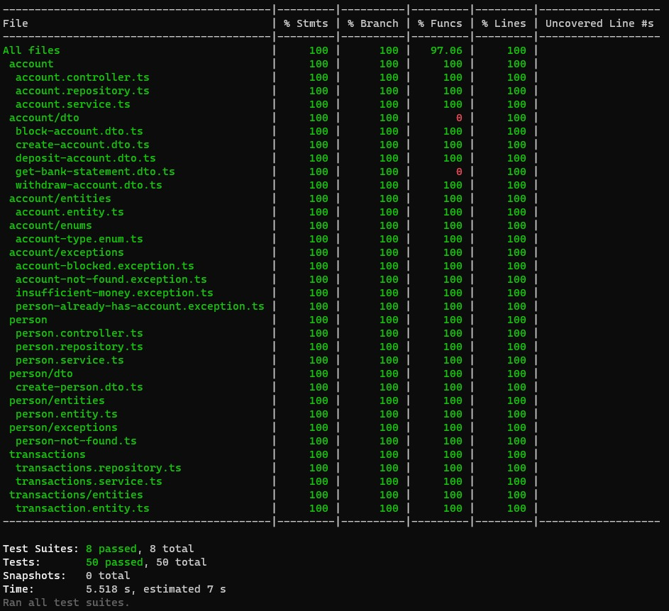

## Account Management

Esse projeto é responsável pelo gerenciamento de contas bancárias.

## Gettings Started

É necessário ter o docker instalado na máquina:
`Docker: 18.06.0+`
`Docker-compose: 1.27.0+`

Para iniciar o sistema, execute o comando: `make init`.
Ele vai criar uma cópia do `.env` baseado no `.env.example`

```bash
# Devido o mapeamento do .env no docker, qualquer mudança no .env, só vai ser
# compartilhada com o container, se executar o `make up`
```

O comando `make up` vai subir os containers da aplicação.

## Docs

É necessário ter o postman na versão que suporte as `Collections 2.1+`.

Dentro do `/docs` está a collection da API, junto com o environments do projeto.
Basta importar os dois arquivos no postman.

## Cobertura de testes

Para executar os testes unitários: `npm run test:unit`
Para executar os testes e2e: `npm run test:e2e`
Para executar a cobertura: `npm run test:cov`

[Collection](./docs/Account Management.postman_collection.json)
[Environments](./docs/Account Management.postman_environment.json)



## Heroku

Endpoint: https://account-management-dock.herokuapp.com/

É possível testar a collection do postman, com o endpoint do heroku. Devido ao plano de desenvolvimento, o dyno fica de stand-by após 30 minutos. Então, ao sair do stand-by há uma lentidão inicial, depois o funcionamento fica correto novamente.

## Kubernetes

[Kubernetes](https://kubernetes.io/), também é conhecido como K8S, é um sistema de código aberto para atomatizar a implantação, escalonamento e gerenciamento de aplicativos em contêineres.

É possível executar o kubernetes nos principais provedores de nuvem (AWS, GCP, Azure) utilizando o mesmo código de configuração.

Seguindo os seguintes passos:

1. Criando um namespace

```bash
kubectl apply -f ./k8s/namespace.yaml
```

2. Criando os secrets da aplicação

```bash
kubectl apply -f ./k8s/namespace.yaml
```

3. Subindo o banco de dados (Atenção)
   O kubernetes foi feito com a ideia de serviços Stateless, para bancos de dados é recomendado que seja feito em outro local e no kubernetes é configurado apenas o endpoint.

Porém, é possível para fins de testes, subir um deployment `StatefulSet`, mas não é recomendado para produção.

```bash
kubectl apply -f ./k8s/database.yaml
```

4. Subindo a aplicação

```bash
kubectl apply -f ./k8s/account-management.yaml
```

No serviço da aplicação, é possível subir como um serviço interno no cluster, se desejar, é possível expor a rede externa. Mas nesse caro seria necessário adicionar mais alguma camada de segurança no node, ou deixar essa responsabilidade para um balanceador de carga (Nginx por exemplo).
